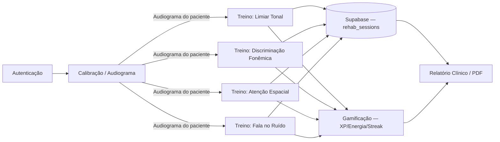

# ARCHITECTURE — topologia por domínio (documentação-only)

> Este documento é a topologia-alvo (módulo 03 do kit adaptado, ver
> `bootstrap/PLANO-VIABILIDADE-E-ADOCAO.md`). **Nada aqui foi migrado fisicamente.** `lib/`
> continua com sua organização atual por camada/tipo. Mover para esta topologia é uma decisão
> arquitetural irreversível (regra 6 do Protocolo Multiagente em `AGENTS.md`) e exige aprovação
> humana explícita antes de qualquer PR que reestruture `lib/`.

## 1. Por que documentar sem migrar

O kit original (`bootstrap/03-topologia.md`) descreve uma estrutura DDD/hexagonal
(`domains/<x>/{domain,services,ports,adapters,actions,components}`) pensada para um monólito
modular web. Este projeto é um app Flutter cliente. A tradução idiomática é a divisão
`data/domain/presentation` por *feature*, comum em arquitetura limpa Flutter — mas aplicá-la
significa mover `lib/screens/`, `lib/ui/screens/`, `lib/core/`, `lib/services/` e `lib/models/`
para dentro de pastas de feature, o que é uma reescrita estrutural, não um overlay. Por pedido
explícito do usuário ("não estragar a estrutura mobile nativo"), este bootstrap só define o alvo.

## 2. Estado atual (não alterado)

```
lib/
├── screens/           # telas clínicas (threshold_test, phonemic_discrimination,
│                       # spatial_attention, speech_in_noise) + screens/widgets/ (dashboards)
├── ui/screens/         # ⚠️ segunda árvore de telas em paralelo (auth, home, calibration,
│                       # onboarding, training_dashboard, mission_report) — débito conhecido,
│                       # ver docs/STATUS.md
├── core/               # gamification_controller, phoneme_map, spatial_controller
├── services/           # supabase_service, tts_service, pdf_service, event_buffer,
│                       # gatekeeper_service, audio_service_manager
├── audio_engine/       # audio_engine.dart, native_engine.dart (bridge FFI → cpp/)
├── models/             # audiogram, phonemic_pair, rehab_session
└── main.dart
```

## 3. Topologia-alvo (feature-first, documentação-only)

```
lib/
├── features/
│   ├── auth/
│   │   ├── domain/          # entidades puras (Usuario, SessaoAuth) + regras, zero I/O
│   │   ├── data/             # implementação via supabase_flutter (implementa interfaces do domain)
│   │   └── presentation/     # telas + controllers (hoje: auth_screen.dart)
│   ├── calibracao_audiometria/
│   │   ├── domain/           # Audiograma, regras de limiar/mascaramento
│   │   ├── data/
│   │   └── presentation/     # hoje: calibration_screen.dart
│   ├── treino_limiar_tonal/
│   │   ├── domain/
│   │   ├── data/
│   │   └── presentation/     # hoje: threshold_test_screen.dart
│   ├── treino_discriminacao_fonemica/
│   │   ├── domain/            # phoneme_map, regras de pares mínimos
│   │   ├── data/
│   │   └── presentation/      # hoje: phonemic_discrimination_screen.dart
│   ├── treino_atencao_espacial/
│   │   ├── domain/            # spatial_controller
│   │   ├── data/
│   │   └── presentation/      # hoje: spatial_attention_screen.dart
│   ├── treino_fala_no_ruido/
│   │   ├── domain/
│   │   ├── data/
│   │   └── presentation/      # hoje: speech_in_noise_screen.dart
│   ├── gamificacao/
│   │   ├── domain/            # gamification_controller (XP, Energia Neural, Streak)
│   │   ├── data/
│   │   └── presentation/      # widgets de progresso/dashboards
│   └── relatorios_clinicos/
│       ├── domain/
│       ├── data/               # pdf_service
│       └── presentation/       # mission_report_screen.dart
├── audio_engine/                # transversal — NÃO é feature; bridge FFI para cpp/, usado por
│                                 # todas as features de treino
├── shared/                      # infra transversal SEM regra de negócio
│   ├── config/                  # (módulo 04 — validação de env, ainda não criado)
│   ├── observability/           # (módulo 05 — logger, ainda não criado)
│   └── widgets/                 # componentes visuais reutilizáveis entre features
└── main.dart
```

### Anatomia de uma feature
```
features/<nome>/
├── domain/       # entidades + regras PURAS (zero Flutter, zero I/O, zero Supabase) — testável em memória
├── data/          # implementações concretas: chamadas supabase_flutter, cache local, etc.
│                  # implementam interfaces (repositórios) definidas em domain/
└── presentation/  # telas, widgets e state (Provider/get_it) — só orquestra, delega regra ao domain/
```

## 4. Regra de dependência (hexagonal)

```
presentation  →  domain (puro)
                     ▲
                     │ implementa interface (repositório)
                   data (Supabase, cache local, TTS, PDF)
```

- `domain/` nunca importa `data/` nem pacotes Flutter — é testável sem widget test, sem mock de
  rede.
- `presentation/` fala com `data/` **apenas através de interfaces definidas em `domain/`**
  (inversão de dependência) — troca de fonte de dados (ex.: cache local vs. Supabase) não deveria
  tocar a tela.
- `audio_engine/` é transversal por natureza (baixa latência, estado de ciclo de vida global via
  `AudioServiceManager.forceStopAll()`, ver `#PROJECT_BRAIN.md` §2) — não vira uma "feature", é
  consumido por várias.

## 5. Boundaries entre features

- Feature não importa o `presentation/` nem o `data/` de outra feature diretamente.
- Comunicação entre features (ex.: audiograma calibrado alimentando os treinos) passa por
  `domain/` público (entidades compartilhadas, hoje em `lib/models/`) ou por estado compartilhado
  explícito (`shared/`), nunca por acesso direto a internals de outra feature.
- Não há event bus/worker neste app (client-only) — "fluxo de eventos" aqui é fluxo de dados
  síncrono em memória/Supabase, não mensageria assíncrona.

## 6. Fluxo de dados entre domínios (estado atual do produto)



Este diagrama descreve o estado atual do produto (confirmado pelos commits recentes: "cadeia
clínica completa — audiograma flui para treino real"), não a topologia-alvo de pastas.

## 7. Decisões relacionadas

- `docs/adr/0001-bootstrap.md` — adoção do Dev OS adaptado, incluindo a decisão de manter esta
  seção documentação-only.
- `docs/DECISIONS.md` — log vivo; qualquer decisão de migrar fisicamente para esta topologia
  entra aqui primeiro, com aprovação humana explícita registrada.
